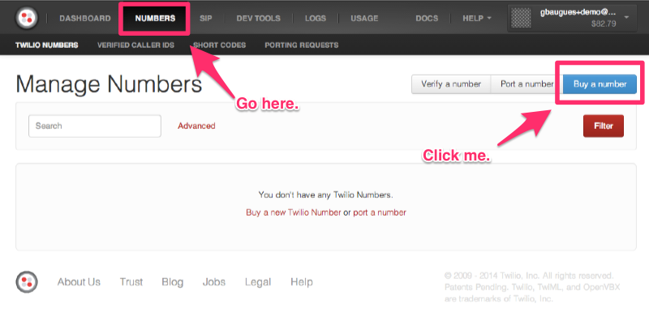
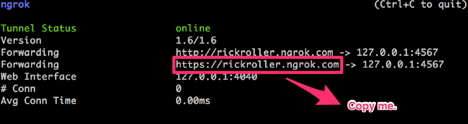
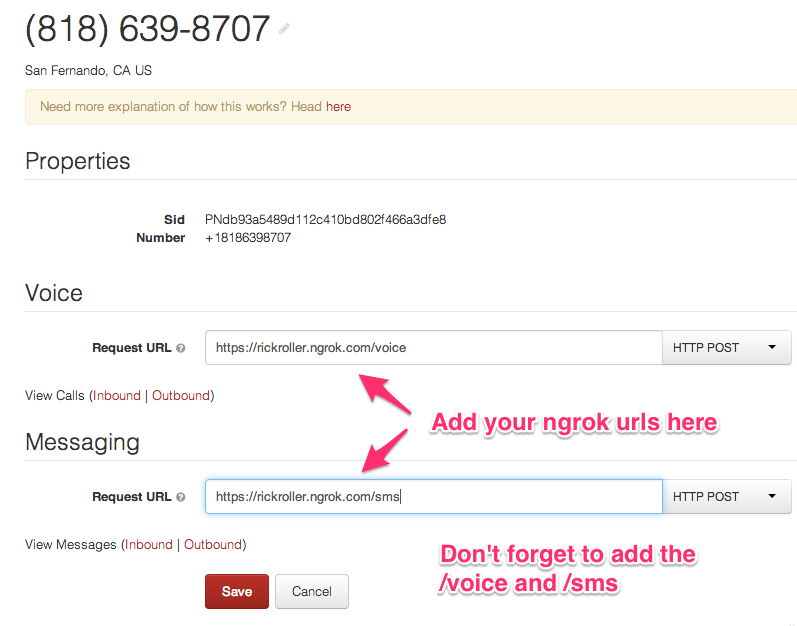

# Twilio and Sinatra Quickstart

Back in 2008, before Twilio publicly launched, the founders built an app to rickroll their friends' phones. It was an internal project meant to test the new voice API -- it was never meant to be made public -- but word of its existence slipped out during dinner with venture capitalist Dave McClure who immediately used the app to [rickroll Michael Arrington](http://zurb.com/soapbox/events/39/Jeff-Lawson-ZURBsoapbox), founder of TechCrunch. Viral press ensued, and Twilio. 

We're going back to our roots to build an app to Rickroll your friend's phones using Ruby, Sinatra and SMS in just 30 lines of code.

* Receive an SMS using Ruby and Sinatra
* Send an SMS using the Twilio Ruby REST client
* Place a phone call using the Twilio Ruby REST client
* Play an MP3 when the call is answered

## Buy a phone number

Sign into your Twilio account or [create a free Twilio account](https://www.twilio.com/try-twilio) if you don't have one already. 



From your account Dashboard, click ```Numbers``` and search for a phone number. Once you've one that suits your fancy, buy it, then click ```Setup Number```. 

## Setup ngrok

Twilio needs access to a publicly accessible URL in order to receive the instructions on what to do when someone sends a text message to our Sinatra app. So that we can avoid deploying to a staging server every time we make a change, we use software called ngrok to create a tunnel through which Twilio can make HTTP requests to our development server. 

[Download ngrok](https://ngrok.com/) and move the file to your home directory, unzip it, then move the file to your home directory. I recommend [registering for a free account on ngrok](https://ngrok.com/user/signup) so that you can  use custom subdomains instead of having ngrok create a random domain every time you start it up. 

Then we'll run ngrok, using the custom domain option (I'll use ```rickroller``` but you should pick your own name), and we'll pass in the port number of our (not yet created) Sinatra app. By default, Sinatra runs on port 4567, so we'll use that.

Assuming you're using the default downloads folder on OSX, this process looks like this: 

```
unzip ~/Downloads/ngrok.zip
mv ~/Downloads/ngrok ~
~/ngrok -subdoman=rickroller 4567
```

Once it ngrok starts up, copy the provided ```https``` url to the clipboard. 



# Set your webhooks

When someone makes a phone call or sends a text message to the phone number you bought, Twilio makes an HTTP request to your server asking for instructions on what to do next. In our case, those two endpoints will look like this:  

```
https://rickroller.ngrok.com/voice
https://rickroller.ngrok.com/sms
```



## Environment Variables

Once you've set up your phone number, go back to your [account dashboard](https://www.twilio.com/user/account) and copy your ```account_sid``` and ```auth_token``` to the clipboard... 


... then set these values as environment variables via the terminal: 

```shell
export ACCOUNT_SID = ABCDEFGHI
export AUTH_TOKEN = 12345679
```

## Setup your Sinatra App

You can also [clone the repo]() instead of writing all of this from scratch.

Create a directory for your project. If you use [RVM](https://rvm.io/), declare the gemset and ruby version you're using:

```shell
cd ~
mkdir rickroll
cd rickroll
echo "2.1.2" > .ruby-version
echo "rickroll" > .ruby-gemset
```

## Gemfile

Create a file called ```Gemfile```. This one will contains pretty standard gems for a Sintara app, with the addition addition of the Ruby Twilio REST Client, ```twilio-ruby```. 

```ruby
#Gemfile
source 'https://rubygems.org'
ruby '2.0.0'
gem 'rack'
gem 'sinatra'
gem 'twilio-ruby'
```

In your terminal, install and run bundler to install your gems. 

```shell
gem install bundle
bundle install
```

## rickroll.rb

Alright, let's write some Ruby. Create a file called ```rickroll.rb``` and add the following requires: 

```ruby
require 'sinatra'
require 'twilio-ruby'
```

### twilio_client()

Next, create a method to instantiate a Twilio REST client by connecting to the API our  ```ACCOUNT_SID``` and ```AUTH_TOKEN```. 

```ruby
def twilio_client()
  Twilio::REST::Client.new ENV['ACCOUNT_SID'], ENV['AUTH_TOKEN']
end
```

We'll use this client to connect to our account and create a new phone call. 

### rickroll(phone)

Create a method called ```rickroll(phone)``` which will use our ```twilio_client()``` to create a new phone call. To initiate a phone call, we'll need three values: a ```to``` number, a ```from``` number (the number you bought), and a url where Twilio will look for instructions when the callee picks up the phone: 

```ruby
def rickroll(phone)
  twilio_client.account.calls.create(
    to: phone,
    from: twilio_phone,
    url: "http://rickroller.ngrok.com/voice"
  )
end
```

Once the person on the end of the ```to:``` number picks up the phone, Twilio makes an HTTP request to the webhook we defined on our dashboard, basically asking "Okay, they picked up. Now what do I do?" In our case... 

### post '/call' do

... we're going to send Twilio a response with instructions to play an MP3 by defining a route with ```post /call``` and responding with TwiML: 

```ruby
post '/call' do
  content_type 'text/xml'
  "<Response>
    <Play>http://demo.twilio.com/docs/classic.mp3</Play>
  </Response>"
end
```

### post '/sms' do 

Now that we have a way to place an outbound call, we need a method to trigger it when a user sends our phone number an SMS. When someone sends a text message to your Twilio phone number, meta-data about that message are passed along via the parameters of that request. The piece of data most interesting to us is the message body, stored in ```params[:Body]```. We'll pass that value into our rickroll method, initiating a phone call. Then we'll reply to the messager with a text message letting them know that we're trying to rickroll the provided number. 

```ruby
post '/sms' do
  rickroll(params[:Body])
  content_type 'text/xml'
  "<Response>
    <Message>Attempting to rickroll #{params[:Body]}</Message>
  </Response>"
end
```


## Fire up your server

And that's it. Start your Sinatra server, text a phone number to your shiny new twilio number (perhaps start with your own), and rickroll away. 

```shell
ruby rickroll.rb
```
