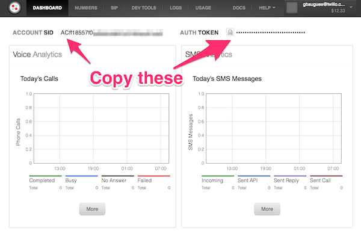

# Twilio and Sinatra Quickstart

The RickRoll has become something of Twilio lore.

Venture capitalist Dave McClure used the app to [Rick Roll the founder of TechCrunch](http://zurb.com/soapbox/events/39/Jeff-Lawson-ZURBsoapbox), Michael Arrington.

> We were never ever supposed to be talking about that ever in the life of the company, because... not at all the use case that we actually want people to associate with Twilio.

Well, here we are anyway.

## Setup Credentials

Copy the the settings template to a ```settings.rb```

I use Avdi's Grimm's method of [declariing constants using module methods](http://devblog.avdi.org/2011/08/18/do-we-need-constants/).

```shell
touch settings.rb
```

Then copy the credentials from your [Twilio dashboard](https://www.twilio.com/user/account) into the ```settings.rb```.



```ruby
#settings.rb

class Settings

  @@account_sid = "ABCDEF..."
  @@auth_token = "10242048..."

  def self.account_sid
    @@account_sid
  end

  def self.auth_token
    @@auth_token
  end

end
```

## Instantiate a twilio client

## Clean up the phone number

We want to make our app just a little bit more user friendly bgy stripping out the whitespace and adding the country code. If you're not in the US, you'll want to change this to work for your own country.

```ruby
string.gsub!(/[\(\)\-\.\s]/, '')
```

And prepend a "+1" to the phone number if it isn't there already:

```ruby
unless string[0..1] == "+1"
  string.prepend("1") unless string[0].eql? "1"
  string.prepend("+") unless string[0].eql? "+"
end
```

